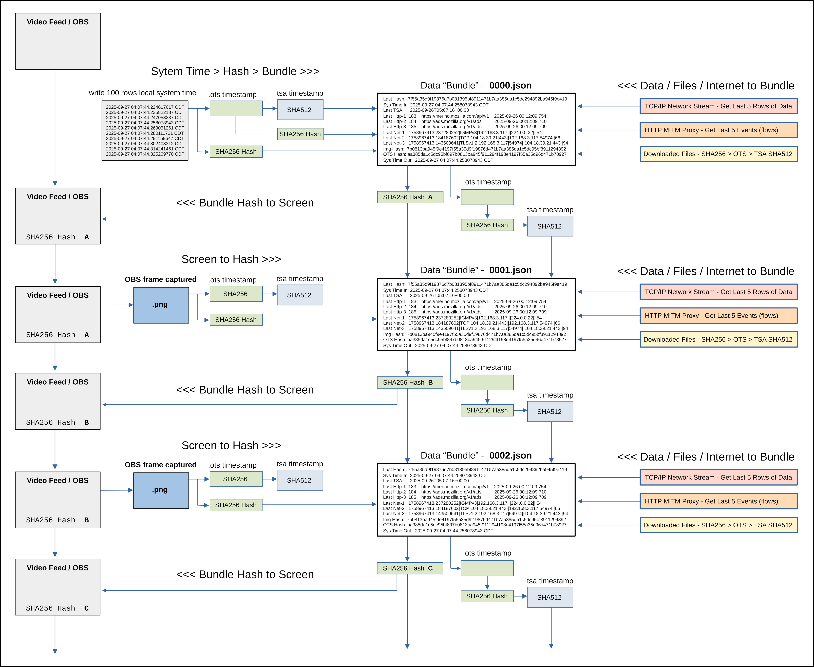

# One-Way-Video

Record a browser session so that anyone can later verify it was not fabricated,
edited, or back-dated, without having to trust the person who recorded it.

[](https://github.com/Matt1Up/One-Way-Video/actions/workflows/ci.yml)
[](LICENSE)
[](LICENSE-docs)
[](https://mncourtfraud.com/evidence/)
[](https://matt1up.substack.com/p/one-way-video)

It is three stages in one repository:

| stage | directory | what it does |
|---|---|---|
| **1. Capture** | `bin/`, `evidence_capture/` | Firefox through mitmproxy, OBS recording the screen. Every few seconds a JSON *bundle* is written holding the previous bundle's SHA-256, the current frame's hash, and the network activity since the last one. The previous hash is shown in an on-screen strip, so the chain is visible inside the video itself. Downloads are hashed and sealed into signed PDFs. Everything is timestamped twice: OpenTimestamps (Bitcoin) and Roughtime (signed time from Cloudflare). |
| **2. Verify** | `verify/` | A batch pipeline that re-hashes every file, re-derives the chain, **crops the strip off every captured frame, OCRs the hash, and compares it to the chain**, upgrades the OpenTimestamps receipts and reads their Bitcoin block, and checks the Ed25519 signatures and nonce binding of every Roughtime receipt. Output: CSV reports anyone can read. |
| **3. Publish** | `postprocess/`, `playback/` | Aligns everything to the video's 30 fps timeline and plays it in a browser with the chain, frames, network streams and downloads scrolling in sync. Live with 15 real sessions at **<https://mncourtfraud.com/evidence/>**. |

Version 1.0 of this repository contained only the first stage. Version 2.0
publishes the other two for the first time.

## What a verified session proves

If every check in `verify/` passes, then, assuming SHA-256 and Ed25519 hold:

- **The files are intact.** Every bundle, frame and receipt is exactly the one
  whose hash the others recorded. Change one byte and a check fails.
- **The order is intact.** The bundles form one chain; nothing was inserted,
  removed or reordered.
- **The screen showed the chain.** Each frame captured for bundle *N* was
  displaying the hash of bundle *N−1*, read back by OCR. The recording shows the
  same strip, so it can be checked against the chain frame by frame.
- **It existed by then.** Every file existed before the Bitcoin block that
  attests it, and every receipt existed at the Roughtime midpoint ±1 s.

It does **not** prove that the material was not made *earlier* than the
timestamps say, that the remote websites served genuine content (TLS is
terminated on the capture machine), or anything about the MP4 itself, which is
tied to the chain only visually. [`verify/README.md`](verify/README.md) states
each of these precisely, along with the weaknesses of the checks themselves and
a roadmap item that would add a lower bound on time. Read that section before
relying on a session.

## See it

- **Live playback**, 15 sessions of Minnesota court-record collection:
  <https://mncourtfraud.com/evidence/>
- **A verified example you can read without installing anything:**
  [`examples/`](examples/) holds the reports from a real 36-minute session
  (280 bundles, 558 receipts, all anchored), sample bundle files, the OCR
  strips, and the six filed complaints the session recorded.
- **The write-up:** <https://matt1up.substack.com/p/one-way-video>

[](images/One-Way-Video-FLOW_200_border.png)

## Install

To **verify** someone else's session you need Python, Tesseract and the `ots`
tool, nothing else:

```bash
git clone https://github.com/Matt1Up/One-Way-Video.git
cd One-Way-Video
python3 -m venv .venv && . .venv/bin/activate
pip install -e ".[verify]"
sudo apt install tesseract-ocr
```

To **capture** you need the whole stack: OBS with its WebSocket server, a
virtual camera kernel module, mitmproxy in its own virtualenv, a Firefox profile
that trusts the proxy, and a signing key. `setup.sh` does all of it on a fresh
Ubuntu machine in eight steps and is safe to re-run:

```bash
bash setup.sh                 # do not run with sudo; it asks when it needs it
source .env                   # written by the last step
python3 bin/check_deps.py     # every package, tool, font, key, and a live OBS WebSocket check
```

## Quickstart

### Capture a session

```bash
evcap interactive             # == python3 bin/control_all.py interactive
> start_session "My Session" 8
# ... browse in the Firefox window that opened; downloads are sealed as they arrive ...
> stop_session
```

`start_session` turns on the virtual camera, the overlay, Firefox, the packet
stream and the download watcher, then starts mitmproxy, OBS recording and the
capture loop at the given interval. `stop_session` tears it all down, converts
the proxy dump to a HAR, and moves the session into `sessions/<name>/`. Every
component can also be started and stopped individually; see
[`docs/commands.md`](docs/commands.md).

### Verify a session

```bash
python3 verify/00_RUN_all_bundle_processing.py --bundles-dir sessions/<name>/bundles
```

Five minutes for a typical session. Reports land next to the bundles. What to
open first is in [`docs/verification.md`](docs/verification.md).

### Publish a session

```bash
python3 postprocess/final_conversion.py --session-dir sessions/<name>
# copy the outputs into playback/data/<slug>/ as described in playback/README.md,
# add the session to playback/config.json, then:
python3 playback/serve.py --port 8000
```

## Repository layout

```
bin/                capture-stage scripts (controller, loop, proxy addon, watchers, overlay, signing)
evidence_capture/   the shared package: paths, locked state, hashing, time, receipts, `evcap`
verify/             the six-stage verification pipeline + Roughtime verifier + README
postprocess/        session → playback data (timecodes, HAR extraction, converters)
playback/           the browser player (HTML/CSS/JS), config schema, range-request server
examples/           a real session's verification reports, samples, and filed complaints
docs/               architecture, configuration, commands, verification, troubleshooting
tests/              unit tests (chain checks, atomic state, receipt verification, time parsing)
overlay/            browser-source overlay pages used in the OBS scene
run/web-server/     optional local viewers for a session in progress
setup.sh            fresh-Ubuntu installer; requirements*.txt; .env.example
```

Runtime directories (`run/`, `downloads/`, `sessions/`, `captures/`) are
git-ignored and hold real evidence; nothing from them belongs in a commit.

## Limitations, honestly

- The timestamps are upper bounds ("no later than"). See the roadmap section of
  `verify/README.md` for the two-line change that would add a lower bound.
- OCR reads the 64-character strip exactly about 40 % of the time; the check
  uses a 6-character window and keeps the processed strips for a human to look
  at.
- Stage 06 reads the Bitcoin block from `ots info` and looks it up on
  `blockstream.info`. For a fully independent check, run `ots verify` against
  your own Bitcoin Core node; the original receipts are shipped unmodified.
- Sessions recorded before v2.0 can carry stale entries in one informational
  field of their bundles (`streams.http_events`); the defect, its exact scope
  and its fix are documented in `verify/README.md`. Verification results and
  published playback data are unaffected.
- The capture stage is Linux-only and was built for one operator's workflow. It
  works; it is not polished software.

## Intended use

This tool intercepts TLS and records the screen. It is built for one thing:
recording **your own** browsing of **public records** on **your own** machine,
so that what you saw and downloaded can be shown to others with evidence that it
was not altered afterwards. It is not designed for, and must not be pointed at,
anyone else's traffic or device. Recording laws, terms of service, and rules of
evidence vary by place and by court; whether a verified session is admissible or
persuasive in any proceeding is a question for a lawyer, not for this README.
The verification pipeline, by contrast, is meant for anyone: a journalist, a
clerk, an opposing expert. That is the point.

## Documentation

- [`docs/architecture.md`](docs/architecture.md) — how the three stages fit, data formats, ports
- [`docs/configuration.md`](docs/configuration.md) — every environment variable, Firefox profile, OBS
- [`docs/commands.md`](docs/commands.md) — controller commands and every script
- [`docs/verification.md`](docs/verification.md) — verifying a session you were handed
- [`docs/troubleshooting.md`](docs/troubleshooting.md)
- [`verify/README.md`](verify/README.md), [`postprocess/README.md`](postprocess/README.md),
  [`playback/README.md`](playback/README.md), [`examples/README.md`](examples/README.md)
- [`CONTRIBUTING.md`](CONTRIBUTING.md), [`SECURITY.md`](SECURITY.md)

## Background

One-Way-Video was built to document irregularities in Minnesota court records
(MCRO and CourtListener) in a way that could withstand the accusation of
fabrication. The irregularity in question: across thousands of court orders
retrieved from the state's public portal, a large share contained no text
specific to the case they were issued in, and a claim like that is only as good
as the proof that the documents really were retrieved, unaltered, from the
court's own portal on the date stated. The capture stage was written first,
script by script, as the problem became clear; the verification and playback
stages followed. Several filenames still carry the marks of that history and
are deliberately unchanged.

## License

Code is MIT ([`LICENSE`](LICENSE)). Documentation and media are CC BY 4.0
([`LICENSE-docs`](LICENSE-docs)). Copyright © 2025-2026 Matt Guertin.
